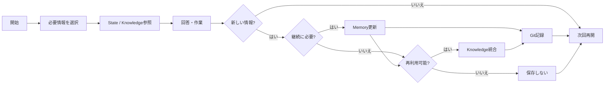

# OKF External Memory Design

Open Knowledge Format（OKF）を、LLM / Agentが継続利用する**外部メモリーの保存・整理形式**として活用するための設計・運用上の知見をまとめた資料です。

## Repository Guide

このリポジトリは、目的別に3つの領域へ分けています。

```text
.
├── README.md
│
├── docs/
│   └── 外部メモリーの設計・Read/Write・運用・学び
│
├── instructions/
│   └── LLM / Agentへ与えるカスタム指示・定期整理プロンプト
│
└── mock-okf-repository/
    └── OKF外部メモリーのリポジトリ構成例
```

### docs/

外部メモリーをどのように設計し、どのように運用しているかを説明する資料です。

- [情報の配置と役割](docs/architecture.md) — Memory / Knowledgeの置き場所と責務
- [会話と外部メモリーの接続](docs/read-write-flow.md) — セッション中の参照・反映方法
- [リポジトリを維持するためのルール](docs/operations-and-governance.md) — 更新・統合・整理の基準
- [設計上のトレードオフ](docs/lessons-learned.md) — 継続性・履歴・検索性のバランス
- [サンプルの見方](docs/sample-usage-guide.md) — 防音ブース例におけるKnowledge / State / Event / Git履歴の関係
- [質問ごとの外部メモリー参照と応答例](docs/conversation-response-examples.md) — 質問・報告ごとのRead / Answer / Writeの具体例

### instructions/

LLM / Agentへ与える運用指示です。

- [Level 1 Custom Instructions](instructions/level-1-custom-instructions.md) — 外部メモリー運用の一段目カスタム指示
- [Memory Consolidation Prompt](instructions/memory-consolidation-prompt.md) — 定期的な記憶整理・統合処理を行うためのプロンプト

### mock-okf-repository/

OKFを使った外部メモリー用Gitリポジトリの構成例です。

- [Repository README](mock-okf-repository/README.md) — リポジトリ構成の説明
- [AGENTS.md](mock-okf-repository/AGENTS.md) — リポジトリ内部のRead / Writeルール
- [Memory Bundle](mock-okf-repository/memory/index.md) — 固有の現在状態・重要な遷移
- [Knowledge Bundle](mock-okf-repository/knowledge/index.md) — 一般化された再利用知識
- [Knowledge Capture Workflow](mock-okf-repository/knowledge/workflows/knowledge-capture.md) — Memory / Knowledgeの振り分けとKnowledge統合手順

## Background

LLMを長期間利用すると、同じテーマが複数の会話やツールにまたがり、現在状態・決定事項・数値・構成・次回開始点などを再説明する必要が生じます。

この運用では、会話全文そのものを記憶として保存するのではなく、

> **次回、正確に作業を再開するために必要な現在状態**

を外部へ保存します。

さらに、そこから得られた再利用可能な原則・手順・検証知識は、現在状態とは分離してKnowledgeとして保存します。

## Architecture

基本構成は、1つのGitリポジトリ内に用途の異なる2つのOKF Bundleを配置する方式です。

```text
External Memory Repository
│
├── memory/       # 固有の現在状態・重要な遷移
│   ├── state/
│   └── events/
│
└── knowledge/    # 一般化された再利用知識
    ├── concepts/
    ├── workflows/
    ├── tools/
    ├── references/
    ├── experiments/
    └── decisions/
```

Memoryでは、

- **Memory State** = 現在のSource of Truth
- **Memory Event** = 独立して残す価値がある重要な状態遷移

を区別します。

## 利用サイクル

必要な情報だけを参照し、作業によって生じた変化をMemoryまたはKnowledgeへ反映します。



Memoryには現在状態を、Knowledgeには固有の状態から切り離して再利用できる知識を保持します。過去の細かな変更はGit履歴へ委ね、現在利用する情報をSource of Truthとして維持します。

## Design Principles

この構成では、OKFだけで「記憶機能」が成立すると考えているわけではありません。

OKFは外部メモリーの**保存・分類・参照単位**として利用し、以下を組み合わせて運用します。

- State / Event / Knowledgeの責務分離
- Indexを使った段階的なContext選択
- 保存するかどうかの判断ルール
- Read / Writeフロー
- Gitによる履歴・差分管理
- 定期的な統合・重複整理
- 秘密情報や不要情報を保存しないルール

また、Git履歴から過去状態を確認できるため、現行ファイルへ変更履歴を無制限に蓄積しません。

現在の作業継続・判断・再利用に不要になった重複情報は統合・整理し、**現在のSource of Truthを正確に保つこと**を優先します。

## Scope

この資料で扱うもの:

- OKFを利用した外部メモリー構成
- Memory State / Memory Event / Knowledgeの役割分離
- Read / Writeのデータフロー
- Gitを利用した履歴管理
- 保存・統合・整理の運用ルール
- LLM / Agentへ与える指示
- OKFリポジトリの構成例
- 運用から得られた効果と課題

扱わないもの:

- OKF仕様そのものの詳細解説
- そのままシステムへ導入できる完成済み実装

## Recommended Reading Order

初めて見る場合は、次の順で確認すると全体像を追いやすくなります。

1. [情報の配置と役割](docs/architecture.md)
2. [会話と外部メモリーの接続](docs/read-write-flow.md)
3. [Level 1 Custom Instructions](instructions/level-1-custom-instructions.md)
4. [OKF Repository Example](mock-okf-repository/README.md)
5. [AGENTS.md](mock-okf-repository/AGENTS.md)
6. [Knowledge Capture Workflow](mock-okf-repository/knowledge/workflows/knowledge-capture.md)

## Positioning

この資料は、OKFの仕様紹介そのものではなく、

> **外部メモリーという仕組みの中で、OKFをどのように利用・運用するか**

を示すためのものです。

プロジェクト・システム・環境などのState管理へ応用する際の参考資料として利用できる構成を意図しています。
