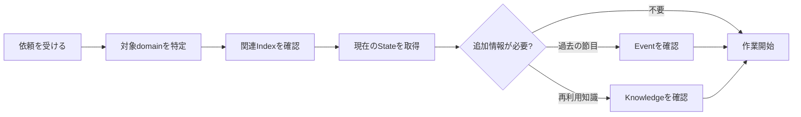
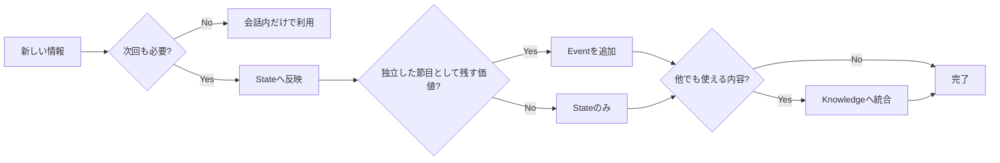

# 会話と外部メモリーの接続

外部メモリーは、会話の前後でまとめて処理するだけではなく、必要な場面で既存情報を取り込み、確定した内容を随時反映する形で使います。

## 会話を始めるとき

継続中のテーマであれば、まず対象domainを特定し、その時点で必要な情報だけを取得します。



対象と無関係な文書は取得しません。

## 会話の途中

会話や作業によって、新しい事実や判断が確定した場合は、その情報の用途を判定します。



同じ出来事から複数の文書が生まれる場合でも、同じ文章をコピーするのではなく、それぞれの用途に合わせて内容を分けます。

## 既存文書を変更するとき

更新対象が既に存在する場合は、現在内容を基準に変更します。

```text
対象文書を取得
   ↓
新しい情報との差を確認
   ↓
現在も有効な内容を残す
   ↓
古くなった部分を置き換える
   ↓
関連Indexを確認
   ↓
Gitへ記録
```

この方法により、新しい会話内容だけで過去の確定事項を消してしまうことを防ぎます。

## 次回の開始位置を残す

継続作業では、結果だけでなく「次にどこから始めるか」をStateへ残します。

例:

```yaml
current:
  stage: 2
  completed_task: 15

next:
  task: 16
```

次のセッションでは、この情報を使って作業位置を復元できます。

会話履歴を最初から読み返すことを前提にせず、再開に必要な最低限の状態を外部へ残す考え方です。

## 具体的な会話例

防音ブースの現在Stateを使い、質問や進捗報告ごとにどのState / Event / Knowledgeを参照・更新するかは、[質問ごとの外部メモリー参照と応答例](conversation-response-examples.md) を参照してください。
