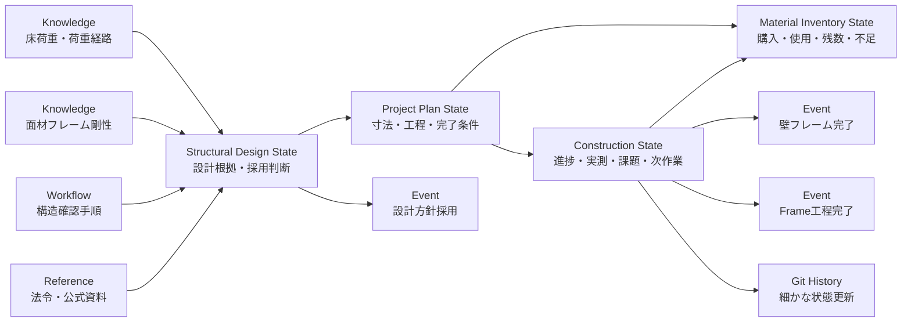

# サンプルの見方

`mock-okf-repository/` には、防音ブース施工を題材にしたOKFの利用例があります。

このサンプルでは、1つの情報をすべて同じ場所へ保存するのではなく、役割ごとにMemory / Knowledge / Eventへ分けています。

## サンプル内の日時

サンプル内の日時は実際の作成・作業日時ではありません。`2026-01-01` を起点とした架空の時系列を使用し、工程の進行は原則として1時間単位で表現しています。

## 全体の関係



## 1. Knowledge

Knowledgeには、特定の防音ブースだけに依存しない情報を置きます。

今回の例:

- [Floor Load and Load Path](../mock-okf-repository/knowledge/concepts/floor-load-and-load-path.md)
- [Sheathed Frame Stiffness](../mock-okf-repository/knowledge/concepts/sheathed-frame-stiffness.md)
- [DIY Structural Load Check](../mock-okf-repository/knowledge/workflows/diy-structural-load-check.md)
- [Japanese Building Structural Load References](../mock-okf-repository/knowledge/references/japan-building-structural-loads.md)

ここには、

- 荷重をどう分解して考えるか
- 木枠と面材を組み合わせたときの変形の考え方
- どの順序で確認するか
- どの公式資料を確認するか

を保存します。

防音ブース固有の寸法や進捗はKnowledgeへ入れません。

## 2. Structural Design State

[Soundproof Booth Structural Design](../mock-okf-repository/memory/state/soundproof-booth-structural-design.md) は、Knowledgeを今回の設計へ適用した結果を保持します。

ここでは、

- 今回の外形寸法
- 想定材料
- 概算重量
- 平均面荷重
- 荷重経路
- 面材を構面として利用する判断
- ドア開口部を補強する判断
- 未確認事項

を記録しています。

```text
Knowledge
    ↓
今回の条件へ適用
    ↓
Structural Design State
```

Knowledgeが「考え方」、Design Stateが「今回どう判断したか」を担当します。

## 3. Project Plan State

[Soundproof Booth Project Plan](../mock-okf-repository/memory/state/soundproof-booth-plan.md) は、施工全体の計画を保持します。

主な内容:

- 目的
- 計画寸法
- 基本構成
- Phase
- 制約
- 完了条件
- 現在位置

Structural Design Stateで決めた構造上の方針を前提に、実際の施工計画を組み立てます。

```text
Structural Design
       ↓
Project Plan
```

## 4. Construction State

[Soundproof Booth Construction Control](../mock-okf-repository/memory/state/soundproof-booth-construction.md) は、施工中に最も頻繁に更新されるStateです。

保持する内容:

- 工程ごとのStatus
- Progress
- Task Board
- 実測値
- Issue
- 依存関係
- 施工中の判断
- Next Actions

例えば、

```text
Frame 45%
↓
左右壁完成
↓
Frame 62%
↓
前後壁・開口補強完成
↓
Frame 82%
↓
天井完成
↓
Frame 94%
↓
最終確認
↓
Frame 100%
```

という進行は、このStateの更新として表現します。

## 5. Material Inventory State

[Soundproof Booth Material Inventory](../mock-okf-repository/memory/state/soundproof-booth-material-inventory.md) は、施工で使う部材の現在在庫を保持します。

ここでは、

- Project全体の必要数
- 購入済み数量
- 使用済み数量
- 現在の残数
- 次工程への割当
- 不足数量
- 再発注状態

を分けて管理します。

```text
Project Plan
    ↓
必要部材

Construction State
    ↓
実際の使用量

Material Inventory State
    ↓
残数・不足・次工程開始可否
```

材料を1枚使用した、1箱購入した、といった通常の変化はInventory Stateを直接更新します。

材料変更によって設計や工程まで変わる場合だけ、必要に応じてEventを追加します。

## 6. Event

すべてのState変更をEventにはしません。

今回のサンプルでは、後から単独で確認する意味がある節目だけEventとして残しています。

例:

- [Structural Design Adopted](../mock-okf-repository/memory/events/2026/01/2026-01-01-soundproof-booth-structural-design-adopted.md)
- [Wall Frames Completed](../mock-okf-repository/memory/events/2026/01/2026-01-01-soundproof-booth-wall-frames-completed.md)
- [Frame Phase Completed](../mock-okf-repository/memory/events/2026/01/2026-01-01-soundproof-booth-frame-phase-completed.md)

一方、

- 左壁の高さを測った
- 右壁を組み立てた
- Progressが62%になった

といった細かな更新は、Construction StateとGit履歴だけで管理します。

## 7. Git履歴

Gitは、Stateの細かな変化を追跡します。

このサンプルでは、施工中の変化を次のように残すことを想定しています。

```text
Construction State作成
        ↓
左右壁フレーム完了
        ↓
壁4面・ドア開口完了 + Event
        ↓
天井フレーム完了
        ↓
Frame Phase完了 + Event
```

このため、State本文へ過去の進捗をすべて追記する必要はありません。

現在のStateは「今どうなっているか」を保持し、細かな過去状態はGitから追跡できます。

## 読み方

防音ブースの現在状況を確認したい場合:

```text
Project Plan
   ↓
Construction State
```

設計理由まで確認したい場合:

```text
Structural Design State
   ↓
Applied Knowledge
   ↓
Reference
```

なぜ現在の状態になったか、重要な節目を確認したい場合:

```text
Construction State
   ↓
Memory Event
   ↓
必要ならGit History
```

## 更新するとき

### 施工が少し進んだ

Construction Stateを更新する。

Eventは原則追加しない。

### Phaseが完了した

Construction StateとProject Planを更新し、後から節目として参照する価値があればEventを追加する。

### 設計条件が変わった

Structural Design Stateを更新する。

変更が施工計画へ影響する場合はProject Planも更新する。

大きな設計変更であればEventを追加する。

### 再利用できる知識が得られた

特定の防音ブースだけに依存しない内容であればKnowledgeへ統合する。

```text
個別施工で観測
    ↓
他のDIYでも使える原則か確認
    ↓
Knowledgeへ統合
```

単に今回の寸法や進捗をKnowledgeへコピーすることはしません。

## このサンプルで示していること

| 情報 | 保存先 |
|---|---|
| 一般的な構造・荷重の考え方 | Knowledge Concept |
| 再利用可能な確認手順 | Knowledge Workflow |
| 法令・公式情報の入口 | Knowledge Reference |
| 今回の設計根拠 | Structural Design State |
| 今回の施工計画 | Project Plan State |
| 現在の施工状況 | Construction State |
| 現在の材料在庫・不足 | Material Inventory State |
| 重要な節目 | Memory Event |
| 細かな変更履歴 | Git History |

ポイントは、情報を大量に保存することではなく、

> **その情報を次に何のために使うかによって保存先を分ける**

ことです。

## 会話からの利用例

この構成を実際のユーザー発話へどう適用するかは、[質問ごとの外部メモリー参照と応答例](conversation-response-examples.md) で確認できます。
